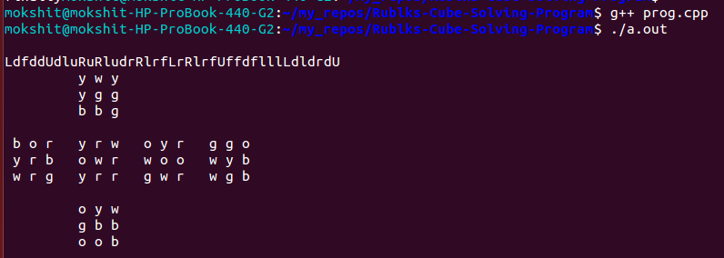
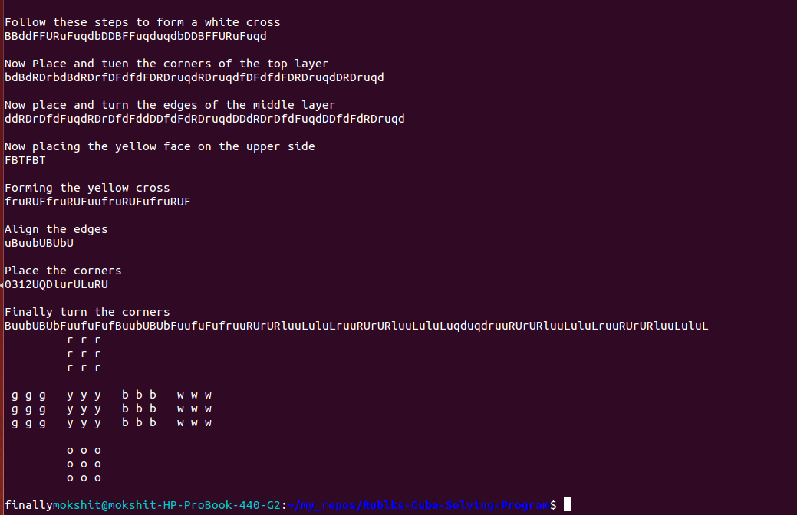

# Rublks-Cube-Solving-Program

A C++ program that takes in the colors on each face of rubiks cube as input and gives in output the sequence of moves that, when
peformed on the cube would give the solved rubiks cube.

Follwing screenshot show the program's input.

And Heres the output on the terminal

Following are the notations for each character of the output sequence

'l'->refers to the  left face rotated clockwise
'L'->refers to the left face rotated anticlockwise
'r'->refers to the right face rotated clockwise
'R'->refers to the right face rotated anticlockwise
'f'->refers to the front face rotated clockwise
'F'->refers to the front face rotated anticlockwise
'b'->refers to the back face rotated clockwise
'B'->refers to the back face rotated anticlockwise
'u'->refers to the up faces rotated clockwise
'U'->refers to the up face rotated anticlockwise
'd'->refers to the down face rotated clockwise
'D'->refers to the down face rotated anticlockwise
